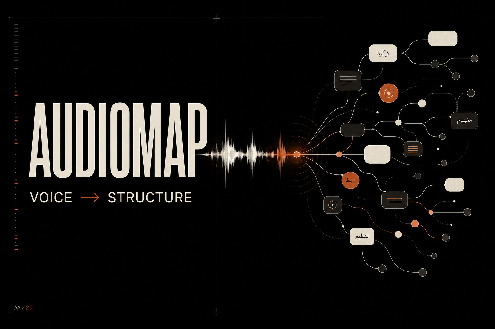

<div align="center">

```
  ))) ──┐                    ┌── ○ Concept A
  )))   ├──  A U D I O M A P ─── ○ Concept B
  )))   │        (AI)        └── ○ Concept C
  voice─┘                           |
  note                           ○ ○ ○
```

**Voice → Structured Mind Maps. Instantly.**

*Speak a thought. LLaMA 3.3 70B on Groq LPU maps it in under 1 second.*

<br/>

[](https://audiomap-five.vercel.app)

<br/>


</div>

---

## What is Audiomap?

Audiomap converts a voice note or typed idea into a fully interactive, draggable mind map — no friction, no manual diagramming, no waiting.

Built for learners, engineers, and anyone who thinks faster than they type.

---

## How it works

```
┌─────────────┐    ┌───────────────┐    ┌────────────────────┐    ┌─────────────────────┐
│ Voice / Text│───▶│ Whisper v3    │───▶│  LLaMA 3.3 70B     │───▶│  React Flow Canvas  │
│  (any lang) │    │  Transcribe   │    │  Structure → Mermaid│    │  Drag · Zoom · Pan  │
└─────────────┘    └───────────────┘    └────────────────────┘    └─────────────────────┘
                         Groq LPU — 800+ tokens/sec — end-to-end < 1 second
```

All AI calls are proxied through Next.js API routes. Your key never leaves the server.

---

## Features at a glance

| | Feature | Detail |
|---|---|---|
| **Voice Input** | Talk freely in Arabic or English | Whisper v3 handles transcription |
| **Text Input** | Type any idea or topic | Direct LLM prompt |
| **Interactive Canvas** | Drag, zoom, connect nodes | Powered by React Flow |
| **Auto-Save** | No account, no database | IndexedDB on your device |
| **Dashboard** | Manage all your maps | Rename, delete, reopen |
| **Export** | PNG · SVG · JSON · Markdown | High-res, share anywhere |
| **Dark / Light mode** | System-aware toggle | Smooth theme switching |
| **Curated Resources** | AI-surfaced learning links | Per topic, per node |

---

## Quick Start

**Prerequisites:** Node.js 18+ · A [free Groq API key](https://console.groq.com)

```bash
# 1. Clone
git clone https://github.com/Almotasembellahawwad/Audiomap.git && cd Audiomap

# 2. Install
npm install

# 3. Set your key
echo "GROQ_API_KEY=gsk_your_key_here" > .env.local

# 4. Run
npm run dev
```

Open **http://localhost:3000**, hit the mic, and speak.

---

## Deploy in one click

[](https://vercel.com/new/clone?repository-url=https://github.com/Almotasembellahawwad/Audiomap)

> After deploying, go to **Project → Settings → Environment Variables** and add `GROQ_API_KEY`.

---

## Tech stack

```
Frontend    Next.js 16 (App Router · Turbopack · Vanilla CSS)
AI Model    Meta LLaMA 3.3 70B  via Groq LPU
STT         OpenAI Whisper v3   via Groq
Canvas      @xyflow/react (React Flow)
Persistence IndexedDB           via idb
Hosting     Vercel
```

---

## Project structure

```
app/
├── page.tsx              ← Landing page
├── app/page.tsx          ← Main workspace
├── dashboard/page.tsx    ← Saved maps
├── pricing/page.tsx
├── about/page.tsx        ← Architecture
└── api/
    ├── generate-map/     ← LLaMA 3.3 → Mermaid
    └── transcribe/       ← Whisper STT

components/
├── FlowCanvas.tsx        ← React Flow wrapper
├── AudioRecorder.tsx     ← MediaRecorder API
└── ThemeToggle.tsx

lib/
├── storage.ts            ← IndexedDB helpers
└── mermaid-to-flow.ts    ← Mermaid → Flow nodes
```

---

## Roadmap

- [ ] Shareable links via Base64 URL
- [ ] Inline node editing on canvas
- [ ] AI "Expand Node" — right-click to deep-dive any concept
- [ ] Cloud sync (Supabase)
- [ ] Real-time collaboration (Yjs + WebSockets)
- [ ] Browser extension
- [ ] Public API (`POST /api/v1/map`)

---

## License

MIT. Fork it, ship it, sell it.

---

<div align="center">
  Built by <a href="https://github.com/Almotasembellahawwad"><strong>Motasem Bellah</strong></a>
  <br/>
  <sub>⭐ Star the repo if Audiomap saved you time</sub>
</div>
